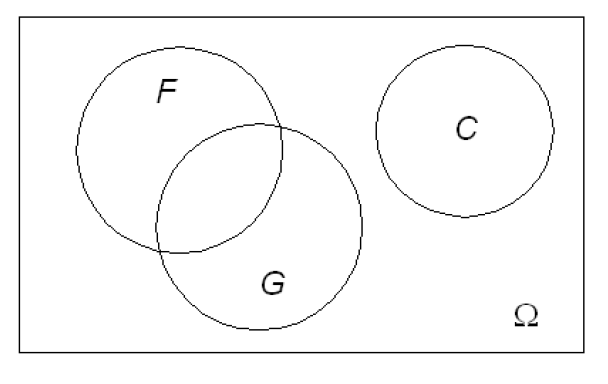
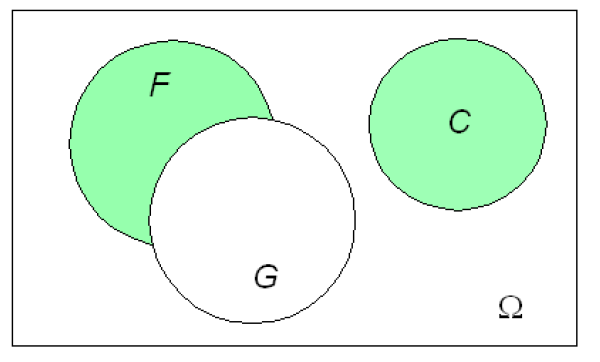
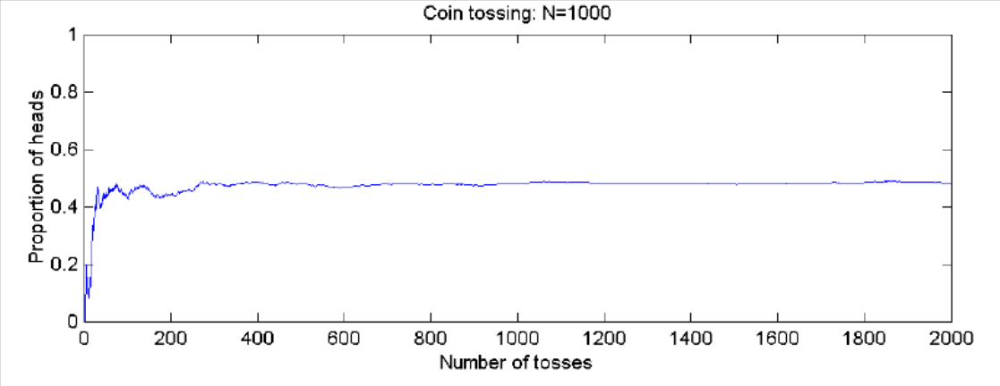
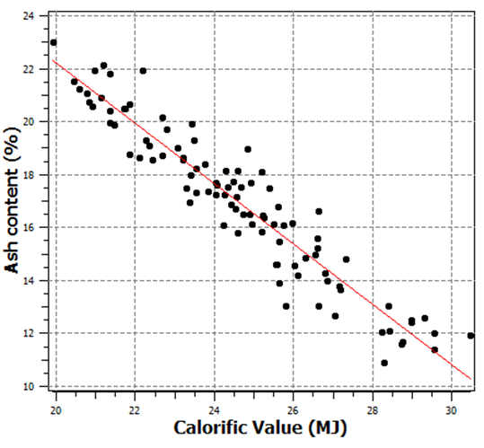

<!--
author:   Jing Li; Jörg Benndorf
email:    Jing.Li@doktorand.tu-freiberg.de; Joerg.Benndorf@mabb.tu-freiberg.de

version:  0.1.0
language: en
narrator: US English Female

icon: ./Images/GS_logo.png

comment:  This simple description of your course.
          Multiline is also okay.

link:     https://cdn.jsdelivr.net/chartist.js/latest/chartist.min.css

script:   https://cdn.jsdelivr.net/chartist.js/latest/chartist.min.js

script: https://nethiri.github.io/YTScriptGrabber/LiaScriptVersion/base.js
script: https://nethiri.github.io/YTScriptGrabber/LiaScriptVersion/consys.js
script: https://nethiri.github.io/YTScriptGrabber/LiaScriptVersion/grabber.js
script: https://nethiri.github.io/YTScriptGrabber/LiaScriptVersion/grabber-lia-bridge.js
script: https://nethiri.github.io/YTScriptGrabber/LiaScriptVersion/lul-lia-bridge.js
script: https://nethiri.github.io/YTScriptGrabber/LiaScriptVersion/lul.js
link: https://cdn.jsdelivr.net/gh/nethiri/YTScriptGrabber@main/LiaScriptVersion/lul.css
link: https://cdn.jsdelivr.net/gh/nethiri/YTScriptGrabber@main/LiaScriptVersion/consys.css

translation: українська https://liascript.github.io/course/?https://github.com/SUUUpoRT/Geostatistics/blob/main/translations/ukrainian/GS_MOOC_uk.md


@gr: @grabber({})

@grabber
<script id="script_@uid" input="hidden">
  window['grabberArg'] = @0;
</script>
@startgrabber(@uid)
@end

@startgrabber
<script id="script_@uid" input="hidden">
  window['grabberUid'] = 'id_@0';
  setTimeout(function() {
    startGrabber();
  }, 100);
</script>
<div id='id_@0'></div>
@end

-->


[](https://liascript.github.io/course/?https://github.com/SUUUpoRT/Geostatistics/blob/main/GS_MOOC_en.md)

# MOOC Geostatistics

```json @grabber
{
  "videoId": "dNpiQPWf0wk",
}
```

## Course introduction

**Lecture/ Practical:** Prof. Dr.-Ing. Jörg Benndorf/ **R …** Regina van den Boogaart 

**Workload (5ECTS:** 60h presence time (lecture/practical), 90h independent work including group work, practical, self-study and preparation for examination.

**Learning Objectives:** You will be able to apply fundamental techniques of geostatistical modelling to model spatial processes in geosciences and geoengineering in general. The focus of this course is on the ability to model geologic resources and estimate minable reserves in a mining project.

**Sudents will be able to:**

- perform explorative data analysis,
- perform an analysis on spatial variability,
- explain the use of the Random Function Model and infer its parameters,
- differentiate different methods in spatial interpolation and simulation,
- discuss support issues of the data critically
- conclude on block sizes, cut-off grades and grade-tonnage curves,
- apply state-of-the-art commercial software in modelling reserves,
- apply international reporting standards for Resources and Reserves.

## Course Content

0. Introduction to the topic [Lecture 0](#lecture-0)
1. A review of probability and statistics [Lecture 1](#Basics-of-Probability-and-Statistics)
2. Application Specific Basics [Lecture 2](#lecture-2)
3. Explorative data analysis [Lecture 3](#lecture-3)
4. Analyzing Spatial Variability-Variography [Lecture 4](#lecture-4)
5. The random function model [Lecture 5](#lecture-5)
6. Inferring parameters of the random function [Lecture 6](#lecture-6)
7. Simple Spatial Interpolation and Simple Kriging [Lecture 7](#lecture-7)
8. Practical Aspects of Simple Kriging [Lecture 8](#lecture-8)
9. Cross Validation and Universal Kriging [Lecture 9](#lecture-9)
10. Kriging with Secondary Data [Lecture 10](#lecture-10)
11. Introduction to Conditional Simulation [Lecture 11](#lecture-11)
12. Introduction to Conditional Simulation continued [Lecture 12](#lecture-12)
13. Cut-off Grades and Change of Support [Lecture 13](#lecture-13)
14. Reporting standards for resources and reserves [Lecture 14](#lecture-14)


### Introduction

    {{0}}
<iframe src="https://video.tu-freiberg.de/media/embed?key=ac2ae6222db34e0a471ecc4261f524c0&width=560&height=315&autoplay=false&controls=true&autolightsoff=false&loop=false&chapters=false&playlist=false&related=false&responsive=false&t=0" data-src="" class="iframeLoaded" width="560" height="315" frameborder="0" allowfullscreen="allowfullscreen" allowtransparency="true" scrolling="no" aria-label="media embed code" style=""></iframe>

    {{1}}
> **Administrative Matters**
>
> Instructors:		Prof. Dr.-Ing. MPhil Jörg Benndorf (TU Bergakademie Freiberg)
> [Joerg.Benndorf at mabb.TU-Freiberg.de](Joerg.Benndorf@mabb.TU-Freiberg.de)
>
> Lecture Schedule: 	Two Parts
>
> - Theory:	 Jörg Benndorf
> - Practical Work:	R … Regina van den Boogaart

#### Test

    {{1-2}}
> We can use interpolation to determine how much ore in a deposit is.

    {{1-2}}
[(X)] Right
[( )] Wrong

    {{2-3}}
> A mineral resource is an in situ (i.e., on surface or underground) mineral occurrence quantified on the basis of geologic data and a geologic cutoff grade only.

    {{2-3}}
[( )] Wrong
[(X)] Right

    {{3-4}}
> Recoverable Reserves = 100% * IE * IP.

    {{3-4}}
[( )] Right
[(X)] Wrong

    {{4-5}}
> Which of the following are methods of spatial interpolation?

    {{4-5}}
[[X]] Triangulation
[[X]] Conditional simulation
[[X]] Polynomial Regression
[[X]] Simple Kriging

    {{5}}
> Please give 3 examples of losses during extraction recovery:

    {{5}}
[[Permitting losses]] [[Geotechnical losses]] [[In-situ variability and mining selectivity]]

### Basics of Probability and Statistics

    {{0-4}}
> **Learning Objectives**
>
> Students recapture their previous knowledge in basic concepts in probability and statistics relevant to this course.

    {{1-4}}
> Key concepts involve
>
>- Probability and conditional probability
>- Random variable
>- Expectation and variance
>- Random function (multiple random variables)
>- Covariance and correlation
>- Gaussian distribution function

    {{2-4}}
Relevant Reading: Any textbook in probability and statistics, e.g. corresponding chapters in Dekking, Frederik Michel, ed. [A Modern Introduction to Probability and Statistics: Understanding why and how](https://katalog.ub.tu-freiberg.de/Record/0-1644977052). Springer, 2005.

    {{3-4}}
Note: This chapter is not intended as an introduction to these topics. It is a rather  repetition of key concepts needed for the course. Student should identify gaps in knowledge and strengthen the understanding  individually before proceeding to the next chapters

    {{4-6}}
>- A **random trial** or **random experiment** is an experiment, whose **outcome** is not known in advance.
>- The **sample space** Ω is the set of all possible outcomes. Particular outcomes are sometimes called sample points or **samples**.
> - Examples:
>
>  - Throwing dice Ω={1,2,3,4,5,6} – discrete
>  - Drilling an exploration hole for seam thickness Ω=[0,∞) – continues

    {{5-6}}
> - **Combining Events**: Let A and B denote two events, then
> - *Union* of the event A and B, denoted A ∪ B, consist of all outcomes of A, or B, or both.
> - *Intersection* of the event A and B, denoted A ∩ B, consists of all outcomes of both, A and B.
> - If A is an event than AC (*A complement or not A*) is the event that A does not occur.
> - A set A is a *subset* of a set B, or equivalently B is a superset of A, if A is "contained" inside B, that is, all outcomes of A are also outcomes of B. A ⊂ B
> - The *empty set* ∅ is called impossible event, its complement Ω is called *certain event*.

    {{6-7}}

Venn diagram

    {{7-8}}

Event C

    {{8-9}}

Event Cc

    {{9-10}}

Event F ∩ G

    {{10-11}}

Event F U G

    {{11-12}}

Event F ∩ Gc U C

    {{12-16}}
**Relative Frequency** of an event A h(A):		Example – tossing a coin

    {{13-16}}

$$ \huge {h(A)=\frac{1}{n}h_n(A)} $$
$ n  $ = Number of trials, $ h_n(A) $ = Number of positive events

    {{14-16}}
The limit of h (as n gets very large) is called **probability**. It is defined as a function P(A) with following properties:

    {{15-16}}
> - P(Ω) 	=1
> - P(ø)  	=0
> - 0 ≤ P(A) ≤ 1
> - P(Ac)=1 - P(A)
> - P(A U B) = P(A) + P(B) (for mutual exclusive)
> - P(A U B) = P(A) + P(B) – P(A ∩ B) (general)

    {{16-19}}
> **Conditional Probability** is a measure of the probability of an event occurring given that another event has occurred.

    {{17-19}}

The conditional probability of A given B is:
$$ \Huge {P(A|B) = \frac{P(A ∩ B)}{P(B)}} $$

    {{18-19}}

Example: What is the probability of CV > 22 MJ/kg (Event A) if we know that the Ash content < 19% (Event B) P(A\|B)?

    {{19-23}}
$$ \begin{drcases}
   \text{P(A|B)⋅P(B) = P(A ∩ B) } \\
   \text{P(B|A)⋅P(A) = P(A ∩ B) }
   \end{drcases}
   \text{P(B|A)⋅P(A) = P(A|B)⋅P(B) } $$

    {{20-23}}
> $$ P(A|B) = \frac{P(B|A)}{P(B)}⋅P(A) $$

    {{21-23}}
> - P(A), the [prior probability](http://en.wikipedia.org/wiki/Prior_probability), is the initial degree of belief in A.
> - P(A\|B), the [conditional probability](http://en.wikipedia.org/wiki/Prior_probability) or posterior probability, is the degree of belief in A having accounted for B.
> - the quotient P(B\|A)/P(B) represents the support B provides for A.

    {{22-23}}
> How do we link this to drill hole data and block estimates?

    {{23-24}}
<iframe src="https://video.tu-freiberg.de/media/embed?key=ac2ae6222db34e0a471ecc4261f524c0&width=560&height=315&autoplay=false&controls=true&autolightsoff=false&loop=false&chapters=false&playlist=false&related=false&responsive=false&t=0" data-src="" class="iframeLoaded" width="560" height="315" frameborder="0" allowfullscreen="allowfullscreen" allowtransparency="true" scrolling="no" aria-label="media embed code" style=""></iframe>

    {{24-25}}
<iframe src="https://video.tu-freiberg.de/media/embed?key=14a676d4a2622353c2559e30ee5c4bf9&width=560&height=315&autoplay=false&controls=true&autolightsoff=false&loop=false&chapters=false&playlist=false&related=false&responsive=false&t=0" data-src="" class="iframeLoaded" width="560" height="315" frameborder="0" allowfullscreen="allowfullscreen" allowtransparency="true" scrolling="no" aria-label="media embed code" style=""></iframe>


### Lecture 2

### Lecture 3

### Lecture 4

### Lecture 5

### Lecture 6

### Lecture 7

### Lecture 8

### Lecture 9

### Lecture 10

### Lecture 11

### Lecture 12

### Lecture 13

### Lecture 14


??[scriptgrabber](https://nethiri.github.io/YTScriptGrabber/)
