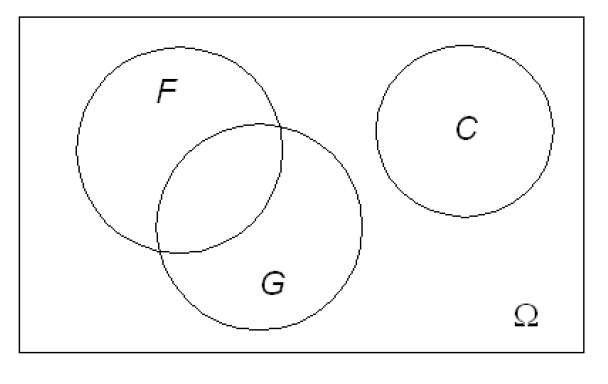
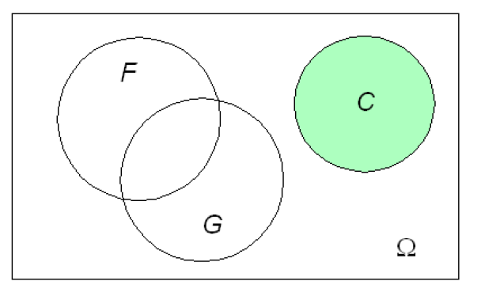
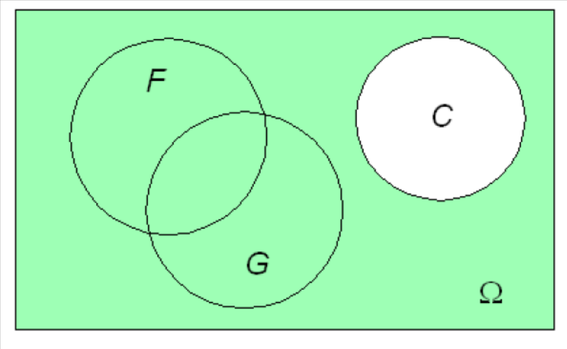
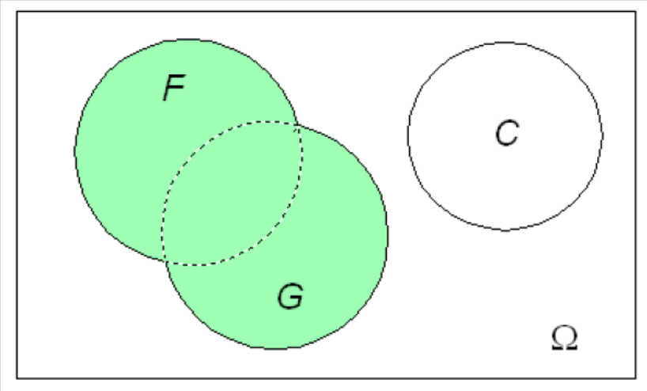
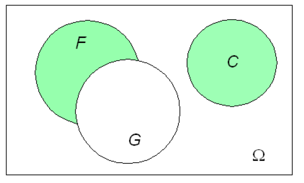
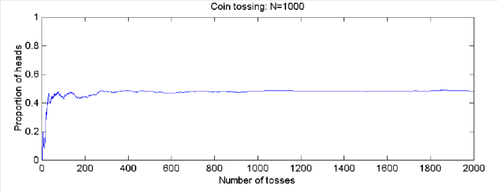
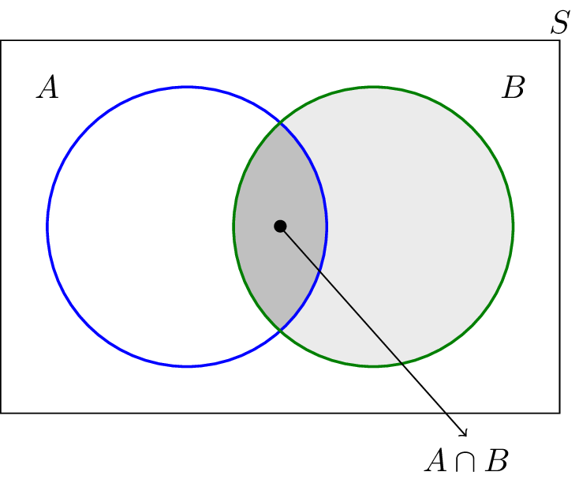
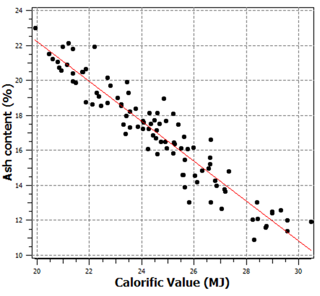

<!--
author:   Your Name
email:    your@email.com
version:  0.1.0
language: en
narrator: US English Female

icon: ./Images/GS_icon.png

comment:  This simple description of your course.
          Multiline is also okay.

link:     https://cdn.jsdelivr.net/chartist.js/latest/chartist.min.css

script:   https://cdn.jsdelivr.net/chartist.js/latest/chartist.min.js

translation: українська ./GS_lecture_1_uk.md
-->

# Review in Probability and Statistics

## Learning Objectives

> Students recapture their previous knowledge in basic concepts in probability and statistics relevant to this course.

Key concepts involve

- Probability and conditional probability
- Random variable
- Expectation and variance
- Random function (multiple random variables)
- Covariance and correlation
- Gaussian distribution function

Relevant Reading: Any textbook in probability and statistics, e.g. corresponding chapters in Dekking, Frederik Michel, ed. [A Modern Introduction to Probability and Statistics: Understanding why and how](https://katalog.ub.tu-freiberg.de/Record/0-1644977052). Springer, 2005.

Note: This chapter is not intended as an introduction to these topics. It is a rather  repetition of key concepts needed for the course.  Student should identify gaps in knowledge and strengthen the understanding  individually before proceeding  to the next chapters

## Random trials/experiments

- A **random trial** or **random experiment** is an experiment, whose **outcome** is not known in advance.

- The **sample space** Ω is the set of all possible outcomes. Particular outcomes are sometimes called sample points or **samples**.

- Examples: 

  - Throwing dice Ω={1,2,3,4,5,6} – discrete
  - Drilling an exploration hole for seam thickness Ω=[0,∞) – continues

## Combining events

 - **Combining Events**: Let A and B denote two events, then

 - *Union* of the event A and B, denoted A ∪ B, consist of all outcomes of A, or B, or both.

 - *Intersection* of the event A and B, denoted A ∩ B, consists of all outcomes of both, A and B.

 - If A is an event than AC (*A complement or not A*) is the event that A does not occur.

 - A set A is a *subset* of a set B, or equivalently B is a superset of A, if A is "contained" inside B, that is, all outcomes of A are also outcomes of B. A ⊂ B

 - The *empty set* ∅ is called impossible event, its complement Ω is called *certain event*.

## Venn diagrams

Venn diagram

Event C

Event Cc

Event F ∩ G

Event F U G

Event F ∩ Gc U C

## Probability

**Relative Frequency** of an event A h(A):		Example – tossing a coin

$$ \huge {h(A)=\frac{1}{n}h_n(A)} $$
$ n  $ = Number of trials, $ h_n(A) $ = Number of positive events

The limit of h (as n gets very large) is called **probability**. It is defined as a function P(A) with following properties:

 - P(Ω) 	=1
 - P(ø)  	=0
 - 0 ≤ P(A) ≤ 1
 - P(Ac)=1 - P(A)
 - P(A U B) = P(A) + P(B) (for mutual exclusive)
 - P(A U B) = P(A) + P(B) – P(A ∩ B) (general)

## Conditional Probability

> **Conditional Probability** is a measure of the probability of an event occurring given that another event has occurred.

The conditional probability of A given B is:
$$ \Huge {P(A|B) = \frac{P(A ∩ B)}{P(B)}} $$

Example: What is the probability of CV > 22 MJ/kg (Event A) if we know that the Ash content < 19% (Event B) P(A|B)?

## Bayes’ theorem

$$ \begin{drcases}
   \text{P(A|B)⋅P(B) = P(A ∩ B) } \\
   \text{P(B|A)⋅P(A) = P(A ∩ B) }
   \end{drcases}
   \text{P(B|A)⋅P(A) = P(A|B)⋅P(B) } $$

> $$ P(A|B) = \frac{P(B|A)}{P(B)}⋅P(A) $$

 - P(A), the [prior probability](http://en.wikipedia.org/wiki/Prior_probability), is the initial degree of belief in A.
 - P(A|B), the [conditional probability](http://en.wikipedia.org/wiki/Prior_probability) or posterior probability, is the degree of belief in A having accounted for B.
 - the quotient P(B|A)/P(B) represents the support B provides for A.

> How do we link this to drill hole data and block estimates?

## Final Page

### Evaluation 1

!?[1](https://youtu.be/vmG2S1qE2Vs)

### Evaluation 2

!?[2](https://youtu.be/ZwNw0zGQ4p8)

